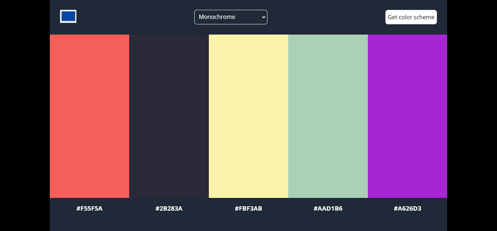

# Color scheme generator

## Table of Content

 * [Overview of the Project](#overview-of-the-project)
      * [Screenshot](#screenshot)
 * [Technologies I Used](#technologies-i-used)
 * [Why I Built This](#why-i-built-this)
 
# Overview of the Project

A Color scheme generator generates a color palette of a particular color of your choosing and it can be saved in the clipboard by clicking on the particular color code which can be used easily in your projects.

## Screenshot

## Technologies I Used

* HTML
* CSS
* JavaScript

## Why I Built This

* I built this project to solve the issue of finding a color scheme for my projects.
* If I find any color suitable for my project but I do not know the hex code for that particular color then using the inbuilt color picker tool I just hover over that color and generate a color palette which makes it much more easy.
* It also helps me to practice my javascript skills and able to learn some new things like how to copy things on a clipboard.
